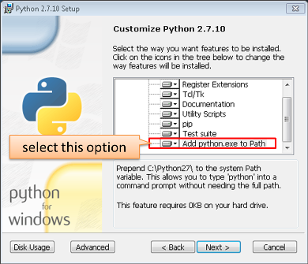

## Table of Contents
 * [Basic Requirements](#basic-requirements)
 * [Arduino IDE](#arduino-ide)
 * [HTTP Server](#http-server)
 * [Stream Interface](#stream-interface)

## Introduction

OTA (Over the Air) update is the process of loading the firmware to ESP module using WiFi connection rather that a serial port. Such functionality became extremely useful in case of limited or no physical access to the module. There is no imposed protection on OTA update process. Such protection should be implemented by developer to ensure that updates are allowed only from legitimate / trusted source.

OTA may be done from:
 - [Arduino IDE](#arduino-ide)
 - [HTTP server](#http-server)

In any case first firmware upload have to be done over a serial port. If OTA routines are correctly implemented in sketch, then all subsequent uploads may be done over the air.

The following chapters provide more details and both methods of doing OTA.


## Basic Requirements

- Flash chip size is 2x the size of the sketch.

## Arduino IDE

Uploading modules wirelessly from Arduino IDE is intended for the following typical scenarios:
- during firmware development as a quicker alternative to loading over a serial
- for updating small quantity of modules
- only if modules are available on the same network as the computer with Arduino IDE

#### Requirements
 - The ESP and the computer must be connected to the same network.

#### Let's Do It

OTA process will be demonstrated using:
- DNS_SD_Arduino_OTA.ino  sketch available from Arduino IDE
- NodeMCU 1.0 board with ESP-12E module

1. Before you begin, please make sure that you have the following installed:
 - Arduino IDE and ESP8266 board support as described under https://github.com/esp8266/Arduino#installing-with-boards-manager
 - Python 2.7.10 (do not install Python 3.5.0 that is not supported):
    1. Upload Python from https://www.python.org/
    2. Start installer
    3. Select “Add python.exe to Path” (see below – that option is not selected by default)
    4. Complete remaining steps of installation
 
    

2. Now prepare the sketch and configuration for the upload over a serial port.

 - Start Arduino IDE and load sketch DNS_SD_Arduino_OTA.ino  available under File >  Examples > ESP8266mDNS

 

 - Update ssid and pass in the sketch  so the module can join your WiFi network

 

 - Configure upload parameters as below (you may need to adjust configuration if you are using a different module):

 

3. Upload the sketch (Ctrl+U). Once done open Serial Monitor (Ctrl+Shift+M) and check if the module has joined your WiFi network. 

 

4. Only if module is connected, after a dozen (or two dozens) of seconds the esp8266-ota port will show up in Arduino IDE:

 

5. Now get ready for your first OTA upload by changing configuration settings as follows:

 

6. If you have successfully completed all the above steps, you can upload (Ctrl+U) the same (or any other) sketch over OTA:

 

**Note** To be able to upload your sketch over and over again using OTA, you need to embed OTA routines inside. Please use DNS_SD_Arduino_OTA.ino as an example.


## HTTP Server

```ESPhttpUpdate``` class can check for updates and download a binary file from HTTP web server.
It is possible to download updates from every IP or domain address on the network or Internet.

#### Requirements
 - web server

#### Arduino code

##### Simple updater

Simple updater downloads the file every time the function is called.

```cpp
ESPhttpUpdate.update("192.168.0.2", 80, "/arduino.bin");
```

##### Advanced updater

Its possible to point update function to a script at the server.
If version string argument is given, it will be sent to the server.
Server side script can use this to check if update should be performed.

Server side script can respond as follows:
- response code 200, and send the firmware image,
- or response code 304 to notify ESP that no update is required.

```cpp
t_httpUpdate_return ret = ESPhttpUpdate.update("192.168.0.2", 80, "/esp/update/arduino.php", "optional current version string here");
switch(ret) {
	case HTTP_UPDATE_FAILED:
		Serial.println("[update] Update failed.");
		break;
	case HTTP_UPDATE_NO_UPDATES:
		Serial.println("[update] Update no Update.");
		break;
	case HTTP_UPDATE_OK:
		Serial.println("[update] Update ok."); // may not called we reboot the ESP
		break;
}
```

#### Server request handling

##### Simple updater

For the simple updater the server only needs to deliver the binary file for update.

##### Advanced updater

For advanced update management a script needs to run at the server side, for example a PHP script.
At every update request the the ESP sends some information in HTTP headers to the server.

Example header data:
```
	[HTTP_USER_AGENT] => ESP8266-http-Update
    [HTTP_X_ESP8266_STA_MAC] => 18:FE:AA:AA:AA:AA
    [HTTP_X_ESP8266_AP_MAC] => 1A:FE:AA:AA:AA:AA
    [HTTP_X_ESP8266_FREE_SPACE] => 671744
    [HTTP_X_ESP8266_SKETCH_SIZE] => 373940
    [HTTP_X_ESP8266_CHIP_SIZE] => 524288
    [HTTP_X_ESP8266_SDK_VERSION] => 1.3.0
    [HTTP_X_ESP8266_VERSION] => DOOR-7-g14f53a19
```

With this information the script now can check if a update is needed. It is also possible to deliver different binaries based on the MAC address for example.

Script example:
```php
<?PHP

header('Content-type: text/plain; charset=utf8', true);

function check_header($name, $value = false) {
	if(!isset($_SERVER[$name])) {
		return false;
	}
	if($value && $_SERVER[$name] != $value) {
		return false;
	}
	return true;
}

function sendFile($path) {
	header($_SERVER["SERVER_PROTOCOL"].' 200 OK', true, 200);
	header('Content-Type: application/octet-stream', true);
	header('Content-Disposition: attachment; filename='.basename($path));
	header('Content-Length: '.filesize($path), true);
	readfile($path);
}

if(!check_header('HTTP_USER_AGENT', 'ESP8266-http-Update')) {
	header($_SERVER["SERVER_PROTOCOL"].' 403 Forbidden', true, 403);
	echo "only for ESP8266 updater!\n";
	exit();
}

if(
	!check_header('HTTP_X_ESP8266_STA_MAC') ||
	!check_header('HTTP_X_ESP8266_AP_MAC') ||
	!check_header('HTTP_X_ESP8266_FREE_SPACE') ||
	!check_header('HTTP_X_ESP8266_SKETCH_SIZE') ||
	!check_header('HTTP_X_ESP8266_CHIP_SIZE') ||
	!check_header('HTTP_X_ESP8266_SDK_VERSION') ||
	!check_header('HTTP_X_ESP8266_VERSION')
) {
	header($_SERVER["SERVER_PROTOCOL"].' 403 Forbidden', true, 403);
	echo "only for ESP8266 updater! (header)\n";
	exit();
}

$db = array(
	"18:FE:AA:AA:AA:AA" => "DOOR-7-g14f53a19",
	"18:FE:AA:AA:AA:BB" => "TEMP-1.0.0"
);

if(isset($db[$_SERVER['HTTP_X_ESP8266_STA_MAC']])) {
	if($db[$_SERVER['HTTP_X_ESP8266_STA_MAC']] != $_SERVER['HTTP_X_ESP8266_VERSION']) ) {
		sendFile("./bin/".$db[$_SERVER['HTTP_X_ESP8266_STA_MAC']]."bin");
	} else {
		header($_SERVER["SERVER_PROTOCOL"].' 304 Not Modified', true, 304);
	}
}

header($_SERVER["SERVER_PROTOCOL"].' 500 no version for ESP MAC', true, 500);

```


## Updater class

TODO describe Updater class
